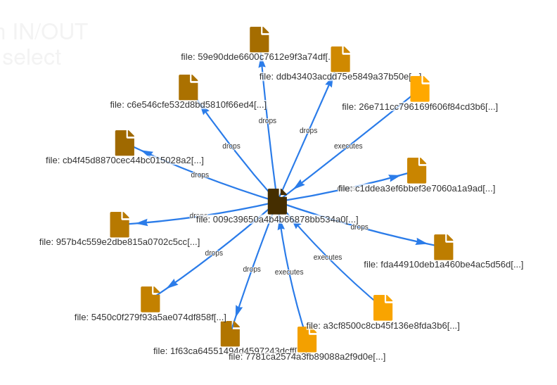

# VirusTotel Query to MISP Objects (vt2m)

While there are multiple Python projects which implement the object creation based on single VirusTotal objects, this
project aims to enable users to directly convert VirusTotal search queries to MISP objects.
**This is work in progress.** Future release will implement handling URLs, Domain and IP objects, too. Right now, only
file objects are implemented.

## Installation

```
pip install vt2m
```

## Usage

If you use the script frequently, passing the arguments as environment variables (`MISP_URL`, `MISP_KEY`, `VT_KEY`)
can be useful to save some time. For example, this can be achieved through creating a shell script which passes the
environment variables and executes the command with spaces in front, so it does not show up in the shell history.

Via `--relations` VirusTotal relations can be resolved and added as MISP objects with the specific relations, e.g. the
following graph was created using vt2m:

*Graph created via `vt2m --uuid <UUID> --limit 5 --relations dropped_files,execution_parents "behaviour_processes:\"ping -n 70\""`*

### Params
```
usage: vt2m [-h] --uuid UUID [--url URL] [--key KEY] [--vt-key VT_KEY] [--comment COMMENT] [--limit LIMIT] [--relations RELATIONS] query

positional arguments:
  query                 VT query

optional arguments:
  -h, --help            show this help message and exit
  --uuid UUID, -u UUID  MISP event uuid
  --url URL, -U URL     MISP URL - can also be given as env MISP_URL
  --key KEY, -k KEY     MISP API key - can also be given as env MISP_KEY
  --vt-key VT_KEY, -K VT_KEY
                        VT API key - can also be given as env VT_KEY
  --comment COMMENT, -c COMMENT
                        Comment to add to MISP objects
  --limit LIMIT, -l LIMIT
                        Limit results of VT query - default is 100
  --relations RELATIONS, -r RELATIONS
                        Comma-seperated list of relations to request PER result (if type fits). This can burn your API credits. Currently
                        implemented: dropped_files, executing_parents, bundled_files
```
